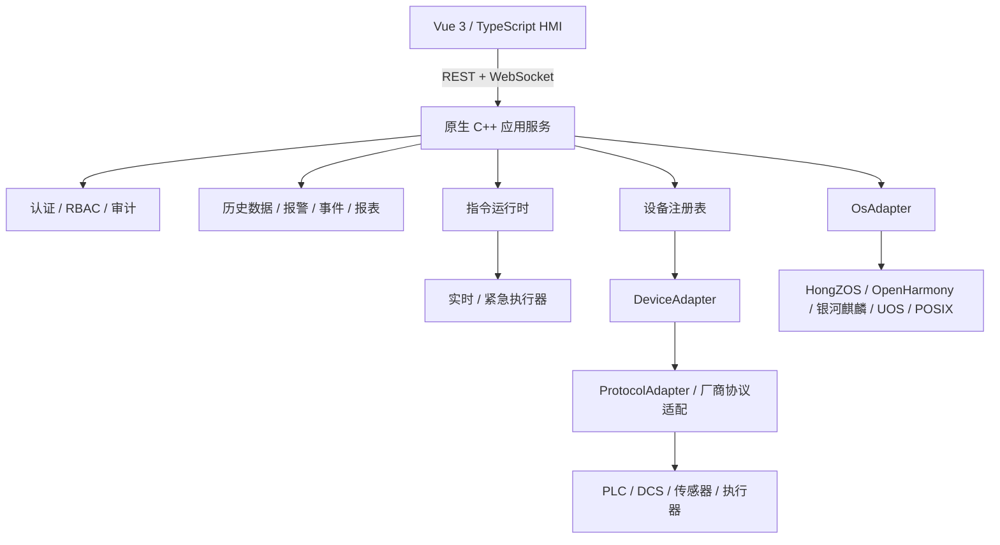

# IDIS

**Industrial Digital Intelligent System · 基于国产操作系统的智慧工厂安全监测控制平台**

IDIS 是一套面向工业现场的数字化智能监测与控制平台，采用原生 C++ 后端、Vue 3 / TypeScript 操作界面，并通过设备适配、协议适配和操作系统适配实现业务层与现场环境解耦。平台面向智慧工厂安全监测、设备管理、实时控制、事件处置、数据分析与国产化运行环境适配等场景。当前仓库对应版本 **1.8.0**。


## 核心能力

- Vue 3 / TypeScript 工业 HMI、监控大屏与管理界面；
- 原生 C++20 后端，提供 REST 与 WebSocket 通信能力；
- 设备状态监测、历史数据、报警管理、事件处置与报表能力；
- RBAC 角色权限、操作审计与命令记录；
- 普通、实时和紧急三类指令执行域；
- `DeviceAdapter`、`ProtocolAdapter`、`OsAdapter` 三类适配边界；
- SQLite 数据持久化与存储维护；
- OpenHarmony / HongZOS 应用壳与国产操作系统适配框架；
- 银河麒麟、统信 UOS、通用 POSIX 及远程 SSH 目标机部署支持；
- 可选智能助手能力，通过环境变量接入外部模型服务。

## 系统架构



平台以应用服务为核心，将界面层、领域服务、设备通信、工业协议和操作系统能力分层组织。现场设备与厂商协议通过适配层接入，业务界面不直接依赖具体设备驱动或操作系统实现，从而降低不同厂区、设备和国产化平台之间的耦合。

## 仓库结构

```text
apps/
  web/                    Vue 3 操作与展示界面
  openharmony-shell/      OpenHarmony / HongZOS 应用壳

backend-cpp/              C++20 后端、运行时、适配器与测试
packages/                 TypeScript 领域模型、契约与共享包
deploy/                   原生、SSH 与目标操作系统部署配置
dev/docker/               Docker 构建环境
docs/                     架构、集成与技术文档
```

## 开发环境要求

### 前端

- Node.js `20.19+` 或 `22.12+`
- npm `10+`

### C++ 后端

- CMake `3.20+`
- 支持 C++20 的编译器
- Ninja
- Boost `1.75+`，包含 Boost.JSON
- SQLite3 开发包
- OpenSSL 开发包
- POSIX threads

## 前端开发

安装依赖并启动开发服务器：

```bash
npm ci
npm run dev
```

执行类型检查、测试与生产构建：

```bash
npm run check
```

## C++ 后端

配置、编译并执行测试：

```bash
cmake -S backend-cpp -B build/backend -G Ninja
cmake --build build/backend
ctest --test-dir build/backend --output-on-failure
```

生产环境构建可关闭模拟设备适配器：

```bash
cmake -S backend-cpp -B build/target -G Ninja \
  -DCMAKE_BUILD_TYPE=Release \
  -DSMART_FACTORY_ENABLE_SIMULATED_ADAPTER=OFF \
  -DSMART_FACTORY_BUILD_TESTS=OFF

cmake --build build/target
```

更多内容见：

- [`backend-cpp/README.md`](backend-cpp/README.md)
- [`docs/integration.md`](docs/integration.md)

## Docker 开发环境

启动：

```bash
docker compose -f deploy/local/docker-compose.yml up -d --build
```

查看日志：

```bash
docker compose -f deploy/local/docker-compose.yml logs -f --tail=200
```

停止：

```bash
docker compose -f deploy/local/docker-compose.yml down
```

本地 Compose 默认将应用绑定到 `127.0.0.1:8001`。

## 配置管理

真实账号、密码、API Key、工厂网络地址和现场专用适配配置不应提交到公开仓库。

- 将 `deploy/local/.env.example` 复制为 `deploy/local/.env` 后填写本地环境变量；
- API Key 通过环境变量或目标平台的密钥管理机制注入；
- `backend-cpp/config/auth.local.json` 用于本地认证配置，并由 Git 忽略；
- `backend-cpp/config/auth.factory.example.json` 提供工厂认证配置结构示例。

## 国产操作系统与目标环境适配

IDIS 通过独立适配层支持不同国产操作系统和目标硬件环境。实际部署需结合 CPU 架构、操作系统版本、SDK/BSP、实时内核配置、系统权限和现场设备接口完成适配与验证。

- HongZOS / OpenHarmony：`apps/openharmony-shell/`、`deploy/hongzos-openharmony/`
- 银河麒麟：`deploy/kylin/`
- 统信 UOS：`deploy/uos/`
- 通用 POSIX / 原生环境：`deploy/native/`
- 远程目标机构建与诊断：`deploy/ssh/`

## 安全

安全策略见 [`SECURITY.md`](SECURITY.md)。
