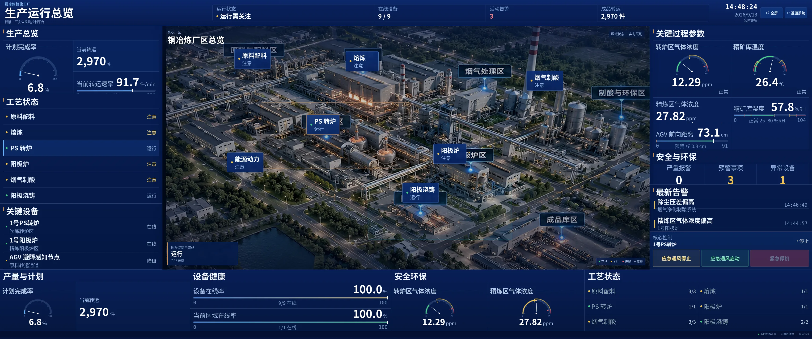
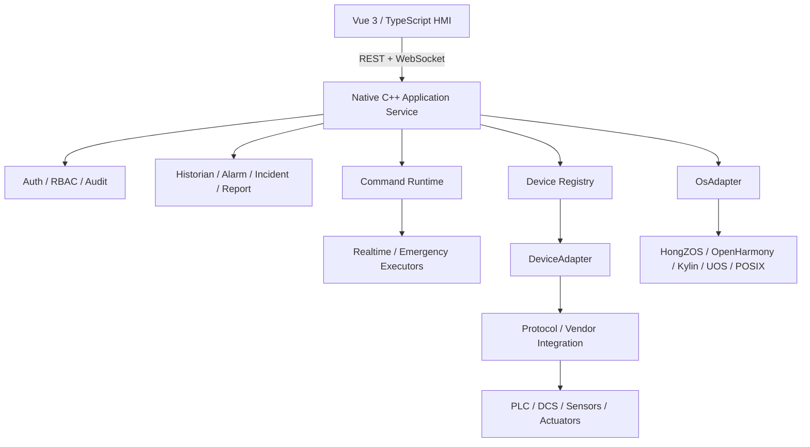

# IDIS

**Industrial Digital Intelligent System · 基于国产操作系统的智慧工厂安全监测控制平台**

IDIS is an industrial monitoring and control platform built around a native C++ backend, a Vue 3 / TypeScript operator interface, and explicit adaptation boundaries for field devices, industrial protocols, and domestic operating systems. This repository snapshot corresponds to application version **1.8.0**.

> 仓库定位：可阅读、可构建、可继续开发的源码仓库。Windows 一键启动脚本、安装日志、交付包校验文件和内部发布过程文件不属于源码主线，已从公开版本中移除。



## What is included

- Vue 3 / TypeScript industrial HMI and management interface.
- Native C++20 backend with REST/WebSocket transport.
- Historian, alarm lifecycle, incident handling, audit and role/permission model.
- Normal, realtime and emergency command execution domains.
- Device registry plus `DeviceAdapter`, `ProtocolAdapter` and `OsAdapter` integration boundaries.
- SQLite persistence and storage maintenance utilities.
- OpenHarmony / HongZOS application-shell scaffold.
- Deployment material for generic POSIX targets, Kylin, UOS and remote SSH integration.
- Optional intelligent-assistant integration configured by environment variables.

## Architecture



The development configuration uses simulated devices. Factory deployment is expected to replace the adapter boundary with validated site-specific implementations; vendor- or OS-specific branches should not leak into the Vue business layer.

## Repository layout

```text
apps/
  web/                    Vue 3 operator and exhibition UI
  openharmony-shell/      OpenHarmony / HongZOS shell scaffold
backend-cpp/              C++20 backend, runtime, adapters and tests
packages/                 Shared TypeScript domain/contracts/API packages
deploy/                   Native, SSH and target-OS deployment material
dev/docker/               Reproducible Docker build definition
docs/                     Architecture, integration and audit notes
```

## Requirements

Frontend development:

- Node.js `20.19+` or `22.12+` (major versions 20/22)
- npm `10+`

Native C++ development:

- CMake `3.20+`
- C++20 compiler
- Ninja
- Boost `1.75+` with Boost.JSON
- SQLite3 development package
- OpenSSL development package
- POSIX threads on the generic native target

## Frontend development

```bash
npm ci
npm run dev
```

Static validation and production build:

```bash
npm run check
```

`npm run check` executes TypeScript/Vue type checking, Vitest and the production frontend build. Only commands backed by files present in this source snapshot are exposed in the root `package.json`.

## C++ backend

```bash
cmake -S backend-cpp -B build/backend -G Ninja
cmake --build build/backend
ctest --test-dir build/backend --output-on-failure
```

Production-oriented builds should disable the simulated adapter:

```bash
cmake -S backend-cpp -B build/target -G Ninja \
  -DCMAKE_BUILD_TYPE=Release \
  -DSMART_FACTORY_ENABLE_SIMULATED_ADAPTER=OFF \
  -DSMART_FACTORY_BUILD_TESTS=OFF
cmake --build build/target
```

See [`backend-cpp/README.md`](backend-cpp/README.md) and [`docs/integration.md`](docs/integration.md).

## Docker development environment

No root-level one-click launcher is included. Use the standard Docker commands directly:

```bash
docker compose -f deploy/local/docker-compose.yml up -d --build
docker compose -f deploy/local/docker-compose.yml logs -f --tail=200
```

Stop the development stack with:

```bash
docker compose -f deploy/local/docker-compose.yml down
```

The local compose configuration binds the application to `127.0.0.1:8001`. Development authentication is disabled by default in the public source configuration so the repository does not ship reusable fixed credentials. Factory mode requires authentication in the backend validation rules.

## Configuration and secrets

Real credentials, API keys, factory addresses and site-specific adapter configuration must not be committed.

- Copy `deploy/local/.env.example` to `deploy/local/.env` for optional local API configuration.
- Store real API keys only in environment variables or the target secret-management facility.
- `backend-cpp/config/auth.local.json` is ignored by Git and can be used for local authenticated testing.
- `backend-cpp/config/auth.factory.example.json` is a placeholder schema only.

## Domestic OS / target integration

The repository contains adaptation scaffolding rather than a claim of universal binary compatibility. Final deployment depends on the actual CPU architecture, OS release, SDK/BSP, realtime kernel configuration, permissions and field-device interfaces.

- HongZOS / OpenHarmony: `apps/openharmony-shell/` and `deploy/hongzos-openharmony/`
- Kylin: `deploy/kylin/`
- UOS: `deploy/uos/`
- Generic POSIX/native: `deploy/native/`
- Remote target build/diagnostics: `deploy/ssh/`

## Verification status of this source cleanup

During repository preparation, the supplied C++ backend was rebuilt from source and all **10/10 CTest cases passed**. The original delivery package also contained evidence of a successful npm/Vue/Vite production build; frontend dependencies were not fully reinstalled in the packaging environment because the dependency download exceeded the execution window. Details are recorded in [`docs/source-audit.md`](docs/source-audit.md).

## Security

See [`SECURITY.md`](SECURITY.md). Never use the development configuration as a factory security baseline without site-specific hardening and target validation.
