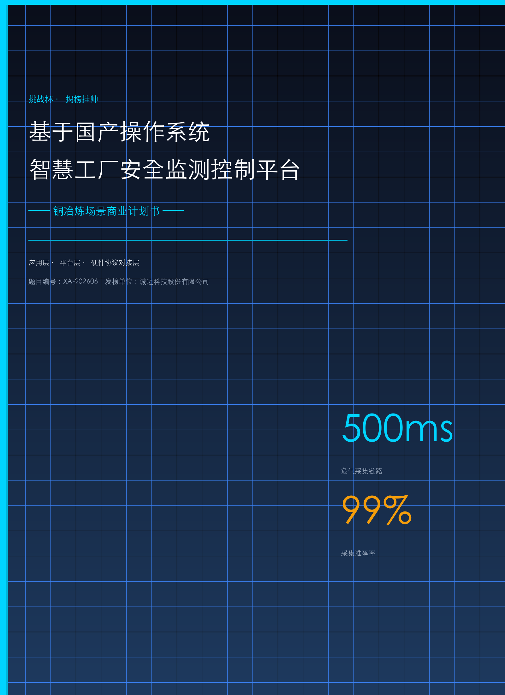
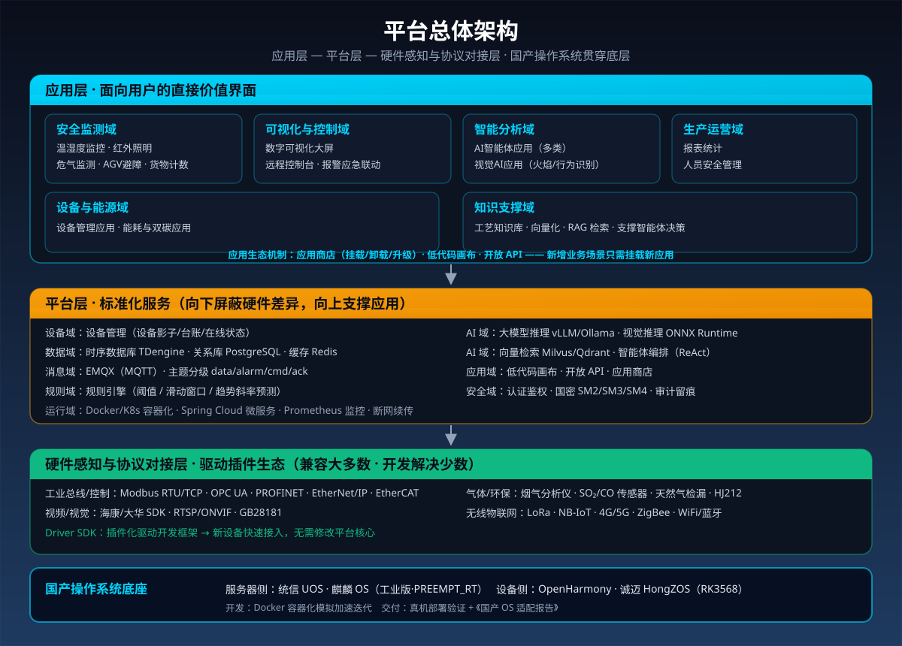
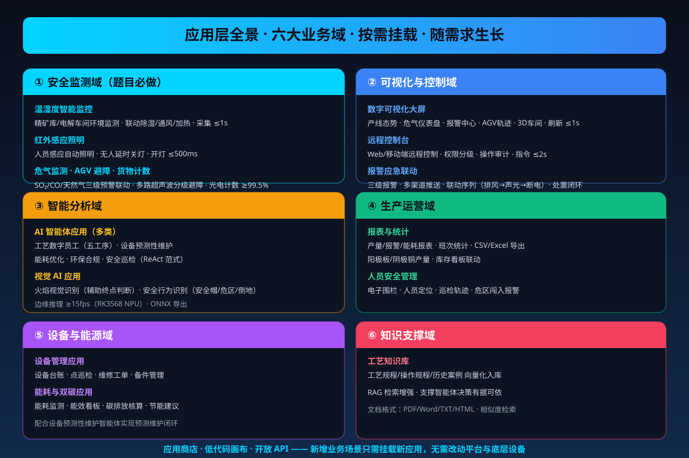
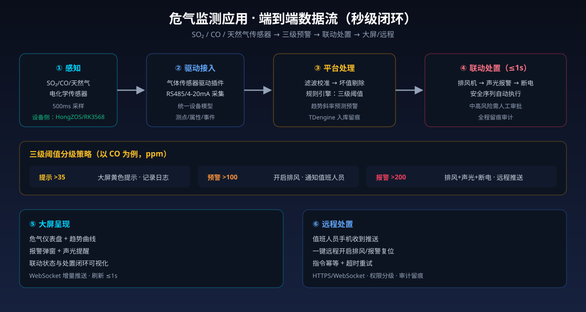
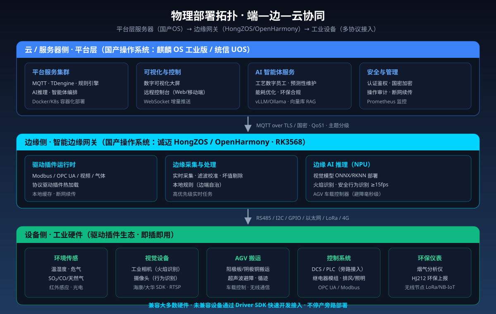

{width="8.3in" height="11.7in"}

　　目录

[一、项目整体介绍](#一项目整体介绍)

[二、项目背景](#二项目背景)

> [2.1 行业现状与需求](#21-行业现状与需求)
>
> [2.2 痛点分析](#22-痛点分析)

[三、技术核心](#三技术核心)

> [3.1 产品概述：一个应用驱动的国产化平台](#31-产品概述一个应用驱动的国产化平台)
>
> [3.2 应用层：平台价值的直接呈现](#32-应用层平台价值的直接呈现)
>
> [3.3 平台层：标准化服务支撑](#33-平台层标准化服务支撑)
>
> [3.4 硬件感知与协议对接层：设备接入基础](#34-硬件感知与协议对接层设备接入基础)
>
> [3.5 技术路线](#35-技术路线)
>
> [3.6 核心技术壁垒](#36-核心技术壁垒)
>
> [3.7 核心应用场景](#37-核心应用场景)

[四、项目应用](#四项目应用)

> [4.1 项目实践（时间线）](#41-项目实践时间线)
>
> [4.2 项目落地（验证与演示）](#42-项目落地验证与演示)
>
> [4.3 实测数据与演示脚本](#43-实测数据与演示脚本)

[五、市场分析](#五市场分析)

> [5.1 行业背景与痛点](#51-行业背景与痛点)
>
> [5.2 目标市场细分](#52-目标市场细分)
>
> [5.3 目标客户画像](#53-目标客户画像)
>
> [5.4 市场规模测算](#54-市场规模测算)
>
> [5.5 竞品分析](#55-竞品分析)

[六、商业模式](#六商业模式)

> [6.1 产品与服务模式](#61-产品与服务模式)
>
> [6.2 定价与盈利模式](#62-定价与盈利模式)
>
> [6.3 推广路径](#63-推广路径)
>
> [6.4 财务预测及分析](#64-财务预测及分析)

[七、项目团队](#七项目团队)

> [7.1 团队概况](#71-团队概况)
>
> [7.2 团队成员](#72-团队成员)
>
> [7.3 指导教师团队](#73-指导教师团队)

[八、附件](#八附件)

# 一、项目整体介绍

　　工业控制系统是国家关键基础设施的"神经中枢"。长期以来，我国大量工控系统依赖国外操作系统与核心工业软件，存在供应链断供、后门漏洞、数据泄露等重大安全风险。与此同时，铜冶炼作为有色金属行业中技术密度最高、安全生产要求最严的工序之一，长期面临三大结构性痛点：**安全风险高**——SO₂、CO、天然气等危气泄漏与高温熔体作业威胁生产安全；**数据孤岛**——现场 DCS、PLC、工业相机、气体分析仪、AGV 等设备"七国八制"并存，协议异构导致智能化应用"无米下锅"；**适配困难**——智能化平台在国产操作系统上落地慢、兼容差，信创改造投入高、周期长。

　　本项目"基于国产操作系统智慧工厂安全监测控制平台"以**铜冶炼智慧工厂**为落地场景，构建**应用驱动的国产化工业安全监测控制平台**。平台的价值核心在**应用层**——安全监测类应用（温湿度监控、红外照明、危气监测、AGV 避障、货物计数等）、可视化与控制类应用（数字可视化大屏、远程控制台）、AI 智能体应用（工艺数字员工、设备预测性维护、能耗优化等）、视觉 AI 应用（火焰识别、安全行为识别）、工业管理对接应用（MES/ERP/EMS、环保上报、报表统计）等，共同构成面向工厂用户的直接价值界面。应用层之下，**平台层**提供数据、消息、规则、AI 等标准化服务；**硬件感知与协议对接层**通过驱动插件生态兼容大多数工业设备、未兼容设备可快速开发新驱动；国产操作系统贯穿底层，实现全栈自主可控。

　　平台覆盖题目要求的五大安全监测功能并延伸至铜冶炼特色场景，实现"监测—预警—控制—统计"全链路闭环，支持应用按需挂载、持续扩展——**从单一安全监测，到智能决策，再到全厂数字化管理，应用生态随需求生长**。

　　**平台的核心价值，直接对应工业企业最关心的四项收益：**

- **应用丰富，开箱即用**：安全监测、可视化控制、AI 决策、管理对接四类应用齐备，按需挂载、随需求扩展，避免"买了平台没有应用可用"；
- **更安全**：危气监测秒级预警、联动"排风—声光—断电"安全序列，异常响应从人工巡检的分钟级压缩至秒级；
- **更自主**：全栈国产操作系统底座 + 驱动插件生态，摆脱国外 OS 与核心软件"卡脖子"风险，信创合规一步到位；
- **更省心**：平台"兼容大多数、开发解决少数"，新设备接入无需改造产线、无需替换 DCS，7 天级极简部署。

　　**一句话定位：** 一个"应用丰富、插上就用、换系统就跑"的国产化智慧工厂安全监测控制平台——从铜冶炼产线的危气预警，到全厂可视化与智能决策，让每一座工厂都安全、自主、高效。

# 二、项目背景

## 2.1 行业现状与需求

　　全球制造业正加速向智能化、数字化、绿色化方向演进，智慧工厂已成为产业升级的核心载体。在我国"制造强国""网络强国""数字中国"战略引领下，构建安全、可靠、自主可控的工业基础软硬件体系已成为国家意志。《"十四五"智能制造发展规划》《有色金属行业碳达峰实施方案》等政策文件相继出台，明确要求加快工业软件国产化替代与数字化智能化改造。

　　从产业格局看，我国大量工控系统依赖国外操作系统与核心工业软件，存在三大现实风险：**供应链断供风险**——制裁与禁运可能随时掐断系统更新与技术支持；**后门漏洞风险**——关键工业数据与控制系统存在被远程控制的安全隐患；**数据泄露风险**——冶炼工艺参数、能源数据等敏感信息面临外泄威胁。

　　从技术演进看，三个方向值得关注：一是架构层面，从传统五层架构向"云边端"协同架构演进，边缘智能网关成为打通存量设备数据孤岛的关键枢纽；二是国产化层面，麒麟 OS、统信 UOS、OpenHarmony 等国产操作系统生态快速成熟，工业发行版（如诚迈 HongZOS）开始破解工业设备互联互通难题；三是应用层面，工业应用正从"单点工具"走向"应用生态"，AI 智能体与深度学习视觉正在从"辅助建议"走向"闭环控制"。

　　然而，国产操作系统在工业场景的落地仍面临"**适配难、兼容差、应用少**"的现实瓶颈：智能化平台多为国外 OS 生态开发，迁移到国产 OS 需要重新编译、适配驱动、调优性能，周期长、成本高；即便平台迁移成功，**缺乏可直接使用的工业应用**也让企业"有平台、无应用"。**一个"应用丰富、能快速适配国产 OS、能兼容大多数工业硬件"的平台化解决方案，是当前工业信创的迫切刚需。**

## 2.2 痛点分析

　　当前工业信创与铜冶炼智能化落地，普遍存在以下四类核心痛点：

**1. 危气风险高，安全监测响应慢**

　　铜冶炼涉及 SO₂ 烟气、CO（还原期）、天然气（还原剂）等危险因素，传统人工巡检周期为数分钟，小异常往往在演变为停炉事故后才被发现；危气泄漏处置依赖人工判断，联动动作（排风、断电）滞后，事故后果严重。

> **平台对应：** 危气监测应用三级阈值分级预警（提示/预警/报警），报警联动"排风→声光→断电"安全序列秒级执行；趋势斜率预测算法变"超标报警"为"趋势预警"，提前处置。

**2. 数据协议异构，设备互联互通难**

　　铜冶炼企业普遍存在 DCS、PLC、工业相机、气体分析仪、AGV 等设备"七国八制"并存的问题。不同年代、不同品牌、不同标准的设备缺乏统一的数据交互协议，数据采集依赖人工抄表，实时性差、准确率低，智能化应用难以穿透至生产控制最底层。

> **平台对应：** 驱动插件生态——将 Modbus、OPC UA、PROFINET、GB28181、HJ212 等主流协议统一封装为标准驱动插件，新设备接入只需注册一个插件；未内置驱动的设备通过 Driver SDK 快速开发，无需修改任何上层逻辑。

**3. 国产 OS 适配难，信创改造投入产出难平衡**

　　传统智能化改造往往需要停产改造、重新布线、替换 DCS，工程周期长达 3~6 个月，单项目投入动辄数百万；且改造后效果难以提前验证。智能化平台在国产操作系统上落地更是困难重重：驱动不兼容、运行库缺失、性能不达标，导致大量信创项目停留在"能开机、能看板"层面。

> **平台对应：** 国产 OS 适配方法论（HAL 抽象层 + 容器化交付 + 构建适配矩阵）+ 旁路接入、不停产、不改造 DCS；7 天级极简部署，试用期内核心指标未达标免收服务费。

**4. 有平台无应用，智能化深度不足**

　　许多工业互联网平台"重连接、轻应用"：数据接进来了，但缺乏可直接使用的工业应用，可视化停留在看板层面，AI 能力难以落地到具体业务。工艺知识、设备维护、能耗管理等场景缺少可用的应用支撑。

> **平台对应：** 应用层提供四类开箱即用应用（安全监测 / 可视化控制 / AI 智能体 / 管理对接），并可独立开发、挂载、卸载——数字员工只是 AI 智能体应用中的一类，平台应用生态随需求持续扩展。

# 三、技术核心

## 3.1 产品概述：一个应用驱动的国产化平台

　　"基于国产操作系统智慧工厂安全监测控制平台"是一个**以应用层为价值核心**的国产化工业安全监测与智能控制平台。平台采用"**应用层—平台层—硬件感知与协议对接层**"三层架构，叙述逻辑自上而下：**应用层**是用户直接使用的价值界面（安全监测、可视化控制、AI 智能体、视觉识别、生产运营、设备能源等应用）；**平台层**是支撑应用的标准化服务；**硬件感知与协议对接层**是接入各类工业硬件的基础；**国产操作系统**贯穿底层，承载全栈。

## 3.2 应用层：平台价值的直接呈现

　　应用层是平台"能干什么"的答案。平台按**业务域**组织应用，六大业务域覆盖工厂核心业务，每类应用解决一类业务问题，独立开发、独立挂载、独立升级：

### 3.2.1 安全监测域：五大功能（题目必做）

　　安全监测域是平台的基础能力层，五大功能完整覆盖题目要求，全部映射至铜冶炼真实场景，可实物沙盘演示。

**（1）温湿度智能监控（精矿库/电解车间）**

| 维度 | 内容 |
|------|------|
| 功能 | 温湿度实时采集，超出工艺阈值自动联动除湿/通风/加热，维持最佳储存与工艺条件 |
| 数据流 | SHT30 传感器 → I2C → 网关滤波校准 → MQTT 上报 → 规则引擎 → 联动执行 / TDengine 入库 / 大屏曲线 |
| 技术实现 | 双传感器冗余（A/B 工位）取均值；滑动中值滤波抑制毛刺；联动指令经继电器下发 |
| 关键指标 | 采集周期 ≤ 1s；联动响应 ≤ 2s；温度 ±0.5℃、湿度 ±3%RH；历史曲线可查 |

**（2）红外感应照明（车间安全照明）**

| 维度 | 内容 |
|------|------|
| 功能 | 红外感应检测人员活动自动开灯，无人延时关灯节能；夜间自动开启高危通道照明 |
| 数据流 | HC-SR501 感应 → GPIO 中断 → 照明控制器 → 继电器 → LED；状态上报平台 |
| 技术实现 | 感应信号边沿触发；延时定时器可配置（30s–5min）；与视觉 AI 人员异常检测联动开灯 |
| 关键指标 | 开灯响应 ≤ 500ms；感应距离 3–7m；节能看板统计节电估算 |

**（3）危气监测（SO₂/CO/天然气）**

| 维度 | 内容 |
|------|------|
| 功能 | SO₂/CO/天然气浓度实时监测，三级阈值分级预警，报警联动"排风→声光→断电"安全序列 |
| 数据流 | 气体传感器 → 驱动插件采集 → 校准补偿 → 规则引擎分级判定 → 报警联动 + 大屏预警 + 远程推送 |
| 技术实现 | 电化学传感器温湿度补偿、零点漂移校正；双传感器交叉验证防误报；趋势斜率预测变"超标报警"为"趋势预警" |
| 关键指标 | 采集链路 ≤ 500ms；联动响应 ≤ 1s；三级阈值（提示/预警/报警）分级处置 |

**（4）AGV 避障（阳极板/阴极铜搬运）**

| 维度 | 内容 |
|------|------|
| 功能 | 多路超声波为 AGV 提供避障，距离分级决策（急停/减速/巡航），保障物料运输安全 |
| 数据流 | 超声波测距 → 车载 MCU 实时决策 → PWM 调速/转向 → 电机执行；状态经网关上报平台 |
| 技术实现 | 前向 2 路 + 侧向 2 路超声波交叉融合取最小值；失效自动降级红外通道并上报"传感器降级"告警 |
| 关键指标 | 避障响应 ≤ 100ms；>60cm 巡航 / 30–60cm 减速 / <30cm 急停；大屏实时显示轨迹 |

**（5）货物感应计数（阳极板/阴极铜产量）**

| 维度 | 内容 |
|------|------|
| 功能 | 光电传感器在浇铸线/打包线自动计数，按班次统计，联动产量与库存看板 |
| 数据流 | 光电开关 → GPIO 中断 → 计数状态机（去抖）→ 计数服务 → 产量看板 / 库存联动 |
| 技术实现 | 软件消抖 10ms + 两次边沿确认，每次完整遮挡-恢复记 1 件；支持手动修正误计 |
| 关键指标 | 计数准确率 ≥ 99.5%；按班次/产线分组统计；与库存看板联动 |

### 3.2.2 可视化与控制域

**（1）数字可视化大屏**

| 维度 | 内容 |
|------|------|
| 功能 | 产线实时态势（五工序点位、危气热力、AGV 轨迹）、报警中心、数据看板（温湿度曲线、危气仪表盘、产量统计、能耗看板）、3D 车间视图 |
| 数据流 | 平台数据 → WebSocket 增量推送 → 大屏组件渲染 |
| 技术实现 | Vue3 + ECharts + Three.js；增量推送仅传变更字段、二进制压缩帧；Canvas/WebGL 渲染优化 |
| 关键指标 | 数据刷新 ≤ 1s；报警弹窗 + 声光提醒；支持 2D/3D 车间视图切换 |

**（2）远程控制台**

| 维度 | 内容 |
|------|------|
| 功能 | Web/移动端远程监控与控制（照明、排风、报警复位、AGV 启停、阈值参数配置） |
| 数据流 | 远程端 → HTTPS/WebSocket → 鉴权 → 指令下发（MQTT cmd 主题）→ 网关执行 → ack 回执 → 前端状态刷新 |
| 技术实现 | 指令幂等、超时重试；权限分级（管理员/操作员/观察员）；操作审计留痕 |
| 关键指标 | 指令下发到执行 ≤ 2s；支持 PC/平板/移动端自适应 |

**（3）报警应急联动**

| 维度 | 内容 |
|------|------|
| 功能 | 分级报警（提示/预警/报警）、多渠道推送（大屏/短信/语音/邮件）、应急联动序列、处置闭环记录 |
| 技术实现 | 规则引擎触发 + 联动动作编排；报警状态锁定部分危险操作（互锁）；处置过程全记录可追溯 |
| 关键指标 | 报警推送 ≤ 1s；联动序列（排风→声光→断电）自动执行；支持远程/现场复位 |

### 3.2.3 智能分析域

**（1）AI 智能体应用（多类，工艺数字员工是其中一类）**

| 智能体应用 | 业务场景 | 能力 | 数据来源 |
|-----------|---------|------|---------|
| 工艺数字员工（配料/熔炼/吹炼/精炼/调度） | 铜冶炼五道工序 | 炉况监测、终点判断、节奏协同 | 温度/SO₂/火焰/品位软测量 |
| 设备预测性维护智能体 | 设备健康管理 | 振动/温度/电流趋势分析、故障早期预警、维修工单生成 | 设备传感器/PLC |
| 能耗优化智能体 | 双碳管理 | 能耗统计、能效异常识别、节能建议 | 能源计量/电表 |
| 环保合规智能体 | 环保监测 | 烟气/废水汇总、HJ212 上报、排放预警 | 烟气分析仪 |
| 安全巡检智能体 | 安全管理 | 巡检编排、异常识别、整改闭环 | 摄像头/传感器 |

| 维度 | 内容 |
|------|------|
| 功能 | 多类智能体面向不同业务场景独立运行、按需挂载；新场景只需开发新智能体应用 |
| 技术实现 | ReAct（Reasoning + Acting）范式：思考→行动→观察→再思考；共享平台 AI 服务（大模型推理/向量检索/工具调用）；多智能体间传递"基于预测模型的未来状态估计"，实现跨工序动态决策闭环 |
| 关键指标 | 推理决策秒级（1–3s）；中高风险操作人工审批后执行；全程留痕审计 |

**（2）视觉 AI 应用**

| 维度 | 内容 |
|------|------|
| 功能 | 火焰视觉识别（辅助终点判断）；安全行为识别（安全帽检测、危区闯入、人员倒地） |
| 数据流 | 工业相机/摄像头 → RTSP/ONVIF/GB28181 → 边缘 NPU 推理 → 结果上报平台 → 联动报警 |
| 技术实现 | CNN（ResNet 轻量版）火焰颜色/形态特征，融合 SO₂ 曲线与温度曲线；YOLO 轻量模型行为识别；ONNX 导出 + RK3568 NPU 推理 |
| 关键指标 | 边缘推理 ≥ 15fps；识别结果联动报警与区域照明 |

### 3.2.4 生产运营域

**（1）报表与统计**

| 维度 | 内容 |
|------|------|
| 功能 | 产量/报警/能耗报表，班次统计，数据导出 |
| 技术实现 | TDengine 聚合查询；按班次/日/月维度；CSV/Excel 导出 |
| 关键指标 | 阳极板/阴极铜产量统计；报警事件统计；能耗报表 |

**（2）人员安全管理**

| 维度 | 内容 |
|------|------|
| 功能 | 电子围栏、人员定位、巡检轨迹管理、危区闯入报警 |
| 技术实现 | 视觉 AI 识别 + 定位标签（UWB/蓝牙可选）；与红外照明、报警联动 |
| 关键指标 | 闯入报警响应 ≤ 2s；巡检轨迹可回溯 |

### 3.2.5 设备与能源域

**（1）设备管理应用**

| 维度 | 内容 |
|------|------|
| 功能 | 设备台账、点巡检、维修工单、备件管理 |
| 技术实现 | 设备生命周期管理；与设备预测性维护智能体联动自动生成工单 |
| 关键指标 | 台账完整率 100%；工单闭环可追溯 |

**（2）能耗与双碳应用**

| 维度 | 内容 |
|------|------|
| 功能 | 能耗监测、能效看板、碳排放核算、节能建议 |
| 技术实现 | 能源计量数据接入（Modbus/电表）；能效异常识别；碳排核算模型 |
| 关键指标 | 能耗数据采集 ≤ 5s；碳排核算报告自动生成 |

### 3.2.6 知识支撑域：工艺知识库

| 维度 | 内容 |
|------|------|
| 功能 | 工艺规程/操作规程/历史案例向量化入库，RAG 检索增强，支撑智能体决策有据可依 |
| 技术实现 | 文档分块 + 向量化（Milvus/Qdrant）；相似度检索；支持 PDF/Word/TXT/HTML |
| 关键指标 | 检索响应 ≤ 1s；知识库与智能体联动 |

### 3.2.7 应用生态机制

| 机制 | 说明 |
|------|------|
| 应用商店 | 应用独立打包、版本管理、一键挂载/卸载，互不影响 |
| 低代码画布 | 拖拽节点（数据读取、AI 模型、规则判断、执行动作、人工审批）编排业务应用，工艺工程师无需专职开发团队 |
| 开放 API | 应用通过平台开放接口接入，第三方可开发应用上架 |

## 3.3 平台层：标准化服务支撑

　　平台层是应用运行的"水电管线"，向下屏蔽硬件差异，向上为应用提供标准化服务，**可快速深度融合嵌入国产操作系统**：

| 服务域 | 服务 | 兼容/可选实现 |
|-------|------|--------------|
| 设备域 | 设备管理（设备影子/台账/在线状态） | 自研 |
| 数据域 | 时序数据服务 | TDengine（推荐）/ InfluxDB |
| 数据域 | 关系数据服务 | PostgreSQL / MySQL / SQLite |
| 数据域 | 缓存服务 | Redis |
| 消息域 | 消息服务 | EMQX（MQTT）/ RabbitMQ / Kafka |
| 规则域 | 规则引擎（阈值/滑动窗口/趋势） | 自研轻量引擎 |
| AI 域 | 大模型推理服务 | vLLM / Ollama（Qwen、DeepSeek 蒸馏版） |
| AI 域 | 视觉推理服务 | ONNX Runtime / OpenVINO |
| AI 域 | 向量检索/RAG | Milvus / Qdrant |
| AI 域 | 智能体编排 | 自研编排引擎 / Flowise 二次开发 |
| 应用域 | 低代码画布 | React Flow 二次开发 |
| 安全域 | 认证鉴权 / 国密服务 | Keycloak / 国密 SM2/SM3/SM4 |
| 运行域 | 容器与集群 / 微服务 / 监控运维 | Docker / K8s / Spring Cloud / Prometheus |

**平台层核心能力：**

- **数据采集服务**：多线程采集引擎 + 数据质量保障（滑动滤波、坏值剔除、校准补偿、时间戳统一）+ 断网续传；
- **消息服务**：主题分级（data/alarm/cmd/ack/log），QoS1 保证送达，TLS/国密加密；
- **规则引擎**：阈值规则、滑动窗口统计、趋势斜率预测、多条件组合、动作联动；
- **AI 服务**：模型注册、推理 API、结果回写，支撑智能体与视觉应用；
- **低代码编排**：工艺工程师可拖拽封装业务应用。

## 3.4 硬件感知与协议对接层：设备接入基础

　　本层是整个平台"兼容大多数、开发解决少数"承诺的落地层：

- **标准设备模型**：所有硬件经驱动抽象为统一设备模型（测点、属性、命令、事件），上层应用只面对标准化接口；
- **驱动插件化**：每个协议/设备一个独立驱动插件，独立注册、独立升级、互不影响，支持热加载；
- **拖拽式接入**：选择驱动 → 填写连接参数 → 自动发现测点 → 即可接入平台，无需编码；
- **Driver SDK**：未覆盖的硬件可快速开发新驱动插件，注册进驱动市场，生态持续累积。

**协议对接矩阵：**

| 类别 | 协议/标准 | 对接硬件示例 |
|------|----------|-------------|
| 工业总线/控制 | Modbus RTU/TCP、OPC UA、PROFINET、EtherNet/IP、EtherCAT | DCS、PLC、温湿度变送器、继电器模组 |
| 视频/视觉 | 海康/大华 SDK、RTSP/ONVIF、GB28181 | 工业相机、摄像头、视频平台 |
| 气体/环保 | 烟气分析仪私有/Modbus 协议、SO₂/CO 传感器、HJ212 | 烟气分析仪、气体传感器、环保上报 |
| 无线物联网 | LoRa、NB-IoT、4G/5G、ZigBee、WiFi/蓝牙 | 无线传感器节点、AGV 车载终端 |
| 自研 SDK | Driver SDK 插件框架 | 任何未内置驱动的设备 |

## 3.5 技术路线

| 阶段 | 核心任务 | 关键产出 | 时间节点 |
|------|---------|---------|---------|
| 阶段一：需求分析与方案设计 | 深入铜冶炼场景梳理安全生产痛点，确定三层架构与国产 OS 适配矩阵 | 场景需求文档、总体方案、国产 OS 调研报告 | 2026年6月 |
| 阶段二：硬件与驱动研发 | 传感器/AGV/工业相机接入，驱动插件框架与协议栈开发 | 硬件沙盘、驱动插件库（Modbus/OPC UA/视频/气体等） | 2026年7月 |
| 阶段三：平台与应用研发 | 采集服务、MQTT、TDengine、规则引擎；六大业务域应用开发 | 平台原型、应用生态、多智能体与视觉应用 | 2026年8月 |
| 阶段四：联调与国产 OS 验证 | 全链路联调、麒麟/UOS/HongZOS 真机部署验证、性能调优 | 真机部署截图、《国产 OS 适配报告》、对比测试数据 | 2026年9月上 |
| 阶段五：交付与拓展（展望） | 参赛提交、产业化拓展至铅锌镍等多金属场景 | 完整作品包、产业化路线图 | 2026年9月后 |

## 3.6 核心技术壁垒

> **这三项壁垒，分别对应第二章三大核心痛点的技术解法——正是它们的联合支撑，才使平台能承载丰富的工业应用、快速适配国产操作系统、兼容大多数工业硬件，实现"通用平台"到"行业可复制产品"的跨越。**

| 技术壁垒 | 解决的痛点 | 核心成果 |
|---------|---------|---------|
| 3.6.1 应用生态机制 | 有平台无应用、智能化深度不足 | 六大业务域开箱即用应用 + 应用商店 + 低代码画布 + 开放 API |
| 3.6.2 驱动插件生态（硬件即插即用） | 数据协议异构、互联互通难 | 内置主流协议驱动，兼容大多数硬件；Driver SDK 快速开发新驱动 |
| 3.6.3 国产 OS 适配方法论 | 适配难、投入产出难平衡 | HAL 抽象 + 容器化 + 适配矩阵，7 天级部署，真机验证 |

### 3.6.1 应用生态机制：让平台"有应用可用、应用可扩展"

　　许多工业互联网平台"重连接、轻应用"——数据接进来了，却没有可直接使用的应用。平台在应用层构建完整应用生态机制：**六大业务域开箱即用应用**（安全监测/可视化控制/智能分析/生产运营/设备能源/知识支撑）覆盖工厂核心业务；**应用商店**实现应用的独立打包、挂载、升级；**低代码画布**让工艺工程师无需专职开发团队即可封装新应用；**开放 API** 支撑第三方应用开发。**新增一个业务场景，只需开发或挂载一个新应用，无需改动平台与底层设备**——这是平台区别于"看板型工业互联网平台"的核心差异。

### 3.6.2 驱动插件生态：工业硬件"即插即用"

　　工业现场设备品牌繁杂、通信协议多达十余种，传统集成方式下，每接入一种新设备都需要专项定制开发。平台设计标准化驱动插件架构，将"设备能力"与"平台逻辑"彻底分离：所有硬件经驱动抽象为统一设备模型，上层应用只面对标准化接口；每个协议/设备一个独立驱动插件，支持热加载。平台已规划覆盖**工业总线/控制、视频/视觉、气体/环保、无线物联网**四大类协议，**新增一台设备只需开发并注册一个驱动插件，无需修改任何已上线应用的代码**——这一特性使平台可低成本横向扩展至铅、锌、镍等其他冶炼品种及更广泛的流程工业。

### 3.6.3 国产 OS 适配方法论：让平台"换系统就跑"

　　平台构建了一套可复用的国产 OS 适配方法论：**第一层**，硬件抽象层（HAL）统一封装设备访问接口，屏蔽不同 OS 的驱动差异；**第二层**，容器化交付，平台整体以 Docker 镜像交付，麒麟 OS/统信 UOS 上直接运行，支持国产 CPU 架构（ARM/龙芯/飞腾）；**第三层**，构建适配矩阵，建立"源码—交叉编译—打包—部署"流水线自动产出各 OS 平台安装包；**第四层**，性能与实时性验证，采集周期、端到端时延、消息吞吐等多平台同口径对比测试。开发调试阶段采用 Docker 容器化模拟国产 OS 环境快速迭代；**最终交付物在统信 UOS、麒麟 OS、OpenHarmony、诚迈 HongZOS 真机环境完成部署与验收，提供真机运行截图与《国产 OS 适配报告》**。

## 3.7 核心应用场景

### 3.7.1 安全监测场景：五大功能全覆盖

　　**温湿度智能监控（精矿库/电解车间）**：实时采集温度湿度，超出工艺阈值自动联动除湿/通风/加热，维持最佳储存与工艺条件；双传感器冗余校验，历史曲线可查。

　　**红外感应照明（车间安全照明）**：红外感应器检测人员活动自动开灯（≤500ms），无人延时关灯节能；夜间自动开启高危通道照明，视觉 AI 检测人员异常时联动照明与报警。

　　**危气监测（SO₂/CO/天然气）**：电化学传感器实时监测，三级阈值分级处置；报警时自动执行"排风→声光→断电"安全序列，支持远程/现场复位，SO₂ 烟气数据可汇总生成环保报表。

　　**AGV 避障（阳极板/阴极铜搬运）**：多路超声波融合避障，距离分级决策（急停/减速/巡航），失效自动降级红外通道并上报告警。

　　**货物感应计数（阳极板/阴极铜产量）**：光电传感器状态机去抖计数，按班次统计，联动产量与库存看板，计数准确率 ≥ 99.5%。

### 3.7.2 智能决策场景：应用生态随需求生长

　　**工艺数字员工（AI 智能体应用）**：为配料、熔炼、吹炼、精炼、调度五道工序配置专属智能体——炉况监测与异常预警、造渣/造铜终点判断、氧化/还原终点判断、全流程节奏协同。多智能体协作解决跨工序动态决策耦合：熔炼工检测到炉况波动主动推送吹炼工调整参数预期；调度工基于各智能体实时预测主动计算节奏匹配方案。**这只是 AI 智能体应用的一类，设备预测性维护、能耗优化、环保合规、安全巡检等智能体应用均可按需挂载。**

　　**设备预测性维护（AI 智能体应用）**：基于设备振动、温度、电流数据趋势分析，识别早期故障征兆，自动生成维修工单，变"事后维修"为"预测维护"。

　　**能耗与双碳管理（AI 智能体应用）**：能耗统计、能效异常识别、碳排放核算，支撑企业双碳合规与节能降耗。

　　**视觉识别（视觉 AI 应用）**：火焰视觉识别辅助终点判断；安全行为识别（安全帽检测、危区闯入、人员倒地）联动报警与区域照明。
# 四、项目应用

## 4.1 项目实践（时间线）

　　**2026年5月：选题立项与方案设计**

　　团队针对"挑战杯"揭榜挂帅赛题（XA-202606 诚迈科技"基于国产操作系统智慧工厂安全监测控制平台"）完成选题立项。深入调研铜冶炼场景安全生产需求，完成国产操作系统（麒麟 OS、统信 UOS、OpenHarmony、诚迈 HongZOS）平台调研与选型分析，确定"应用层—平台层—硬件感知与协议对接层"三层架构总体方案。

　　**2026年6-7月：硬件搭建与驱动研发**

　　搭建铜冶炼沙盘：温湿度、危气（SO₂/CO/天然气）、红外感应、超声波、光电等传感器接入 RK3568 边缘网关；完成 AGV 小车组装；开发驱动插件框架与 Modbus/OPC UA 等协议驱动；工业相机接入视觉识别链路。

　　**2026年7-8月：平台与应用研发**

　　完成采集服务、MQTT 消息总线、TDengine 时序存储、规则引擎；开发安全监测、可视化大屏、远程控制等应用；开发 AI 智能体应用（工艺数字员工、预测性维护）与火焰/行为视觉应用。

　　**2026年9月：联调与国产 OS 真机验证**

　　全链路联调与性能调优；在麒麟 OS（工业版）、统信 UOS、OpenHarmony/HongZOS 真机环境完成部署验证；输出《国产 OS 适配报告》与多平台对比测试数据；完成全部参赛材料（PPT、演示视频、设计/开发/测试文档、总结报告、源代码、声明函）并提交。

## 4.2 项目落地（验证与演示）

　　**实物沙盘 + 软件大屏双演示体系：**

- **实物沙盘**：铜冶炼工艺沙盘集成温湿度、危气、红外、超声波、光电等真实传感器 + AGV 小车 + RK3568 边缘网关（国产 OS），现场可真实演示五大功能与联动处置；
- **软件大屏**：数字可视化大屏实时呈现产线态势、报警中心、智能应用状态、AGV 轨迹、产量统计，支持远程控制；
- **国产 OS 真机演示**：麒麟 OS / 统信 UOS / HongZOS 真机部署运行截图，作为"国产化落地"的直接证据。

　　**核心指标自测目标（团队实测，杜绝引用外部数据）：**

| 指标 | 目标值 | 验证方式 |
|------|--------|---------|
| 危气采集链路 | ≤ 500ms | 打点统计 |
| 报警联动响应 | ≤ 1s | 事件时间戳 |
| 计数准确率 | ≥ 99.5% | 标准件比对 |
| 视觉推理帧率 | ≥ 15fps（RK3568 NPU） | 边缘实测 |
| 国产 OS 真机部署 | 麒麟/统信/HongZOS 全通过 | 部署验证记录 |

## 4.3 实测数据与演示脚本

　　为现场擂台赛设计 5 分钟标准演示流程：危气泄漏 → 自动联动（排风/声光/断电）→ 大屏告警 → 远程处置 → 恢复正常，确保功能完整性与技术先进性可被评委直观感知。演示脚本覆盖：平台登录、大屏总览、五大功能逐项演示、智能应用演示（数字员工/视觉识别）、远程控制、国产 OS 真机展示六个环节。

# 五、市场分析

## 5.1 行业背景与痛点

　　工业软件与工业操作系统国产化是国家"信创"战略的核心阵地。据行业研究机构数据，我国工业软件市场规模已超千亿元，但国产化率长期偏低，尤其在研发设计与生产控制类高端工业软件领域，国外产品占据主导。随着《"十四五"智能制造发展规划》和信创政策持续推进，工业操作系统与工业软件的国产化替代已从党政办公延伸至能源、冶金、制造等关键工业领域，进入加速落地期。

　　与此同时，铜冶炼行业正处于"规模扩张"向"高质量发展"转型的关键节点：原料加工费持续下行、能耗与环保指标收紧、一线操作人员老龄化加剧，倒逼企业通过数字化、智能化手段挖掘存量效益。行业智能化渗透率不足 30%，大量中小冶炼企业仍处于自动化补课与信息化起步阶段，市场空间广阔。

　　行业当前面临的核心痛点已在第二章详述：危气风险高响应慢、数据协议异构难互通、国产 OS 适配难投入大、有平台无应用智能化浅。**"国产化 + 安全监测 + 应用生态"三位一体的平台化解决方案，正处于政策与市场的双重窗口期。**

## 5.2 目标市场细分

　　"基于国产操作系统智慧工厂安全监测控制平台"的市场空间由三部分叠加构成：**信创改造市场**（国产 OS 迁移与适配）、**工业安全监测市场**（危气/环境/设备监测）、**工业应用软件市场**（可视化/AI 智能体/管理对接应用）。按客户规模与需求特征，可划分为三大细分市场：

| 细分市场 | 典型客户 | 核心需求 | 匹配产品 |
|---------|---------|---------|---------|
| 大型冶炼集团（年产 40 万吨+） | 江西铜业、铜陵有色、云南铜业等 | 信创合规 + 全流程智能协同 + 私有化部署 | 私有化平台 + 增量效益分成 |
| 中小型冶炼企业（年产 5-40 万吨） | 各省级民营冶炼企业 | 安全监测 + 低成本智能化升级 | SaaS 订阅 + 应用按需购买 |
| 其他流程工业（铅锌镍、化工、建材等） | 有色/化工/建材企业 | 危气安全监测 + 国产化适配 | 平台复制 + 行业应用定制 |

## 5.3 目标客户画像

**（1）价值引爆型客户：大型冶炼集团**

　　他们是年产规模超 40 万吨的国有或头部民营冶炼企业，拥有完善的自动化产线和数据采集基础，但面临两大刚性需求：一是信创合规压力——关键工控系统国产化替代有明确时间表；二是利润压力——加工费下行倒逼精细化管控。他们需要的不只是一套软件，而是一个**能通过信创验收、又真正产生效益的国产化平台**——安全监测应用解决合规，AI 智能体应用创造效益。增量效益分成模式与其"效果为先"的决策逻辑高度契合。

**（2）升级替代型客户：中小型冶炼企业**

　　他们是年产 5-40 万吨的中型民营冶炼企业，机制灵活、决策务实，但信息化基础弱、缺乏自有技术团队。其核心痛点高度集中在安全与成本：危气监测靠人工、智能化改造成本高。**"订阅试用 + 应用按需购买 + 7 天极简部署"**的低门槛模式，与中小企业"怕投入、怕绑定、怕停产"的决策心理精准匹配——先买安全监测应用解决刚需，再逐步加购 AI 智能体等增值应用。

**（3）准入门户型客户：其他流程工业与观望企业**

　　他们遍布于铅锌镍、化工、建材等流程工业，对国产化安全监测平台有潜在需求但仍在观望。订阅试用服务以轻量投入在其自有产线验证效果，当安全预警与节能数据实实在在跑出来，观望者便自然生长为坚定的升级者。

## 5.4 市场规模测算

### 5.4.1 TAM-SAM-SOM 测算逻辑与假设

| 层级 | 定义 | 测算范围 | 关键假设 |
|------|------|---------|---------|
| TAM（潜在市场总额） | 中国工业安全监测 + 信创适配 + 工业应用软件市场 | 有色冶金行业数字化改造 + 流程工业安全监测 | 有色冶金智能化渗透率 <30%，政策驱动加速 |
| SAM（可服务市场） | 平台技术可覆盖的市场 | 中国铜冶炼企业 + 有色冶炼企业 | 以铜冶炼为主战场，逐步辐射铅锌镍 |
| SOM（可获得市场） | 项目在 5 年内可实际获取的市场 | 基于竞争格局和推广能力估算 | 2026-2030 年累计渗透率目标 |

### 5.4.2 市场规模驱动因素

| 驱动因素 | 影响方向 | 对市场空间的作用 |
|---------|---------|----------------|
| 信创政策刚性推进（关键基础设施国产化） | ↑↑ | 国产 OS 平台需求爆发，市场基数扩大 |
| 双碳目标与环保监管趋严 | ↑↑ | 危气监测、环保上报（HJ212）成为合规刚需 |
| 加工费下行倒逼冶炼精细化管控 | ↑↑ | 企业智能化付费意愿增强 |
| 国产 OS 工业发行版成熟（HongZOS 等） | ↑ | 技术可行性提升，落地门槛下降 |
| 应用生态带动二次销售 | ↑ | 存量客户 ARPU 提升，获客成本下降 |

## 5.5 竞品分析

### 5.5.1 竞争格局

　　工业安全监测与工业智能化赛道竞争格局呈现"头部集中、长尾分散"特征：第一梯队为具备全链路解决方案能力的综合服务商（工业互联网平台厂商）；第二梯队为专注于特定工艺环节或特定品类的专业厂商；第三梯队为技术积累较浅的新兴企业。主流厂商竞争围绕**感知、决策、执行**三大核心能力展开，其中具备"国产化适配 + 安全闭环 + 应用生态"全栈能力的厂商愈发受到青睐。

### 5.5.2 主要竞品对比分析

| 竞品类型 | 代表 | 产品定位与优势 | 差异化分析（我们的优势） |
|---------|------|--------------|----------------------|
| 工业互联网平台厂商 | 卡奥斯 COSMOPlat、浪潮云洲 | 跨行业通用平台，擅长数据连接，但"重连接、轻应用" | 我们以应用层为核心：安全监测/可视化/AI 智能体/管理对接四类应用开箱即用，直接解决业务问题 |
| 工控/自动化厂商 | 和利时、宝信软件 | DCS/PLC 控制执行能力强，全国产化积淀深 | 他们强于"执行"与硬件，我们强于应用生态 + 多协议即插即用接入，二者可互补集成 |
| 工业 AI/智能体厂商 | 华院计算、数商云等 | 算法与认知模型领先，侧重智能分析诊断 | 智能体只是我们应用层的一类；我们以平台承载多类应用，且底座全国产化 |
| 国际工业软件 | 西门子、罗克韦尔等 | 全栈能力强，但非国产化 | 供应链断供风险 + 信创合规不达标，国产化替代是政策刚需 |
| 传统安全监测系统 | 各类安监软件 | 功能单一，仅报警展示 | 我们实现"监测—预警—控制—统计"闭环 + 应用生态扩展，能力边界更宽 |

　　各主要竞品在单一维度上或许具备各自的特色优势——有的在控制执行层面技术雄厚，有的在 AI 算法层面有所专长，有的在工业互联网平台层面覆盖面广——但能够将"**应用生态、国产 OS 全栈适配、多协议即插即用、安全监测控制闭环**"四大能力同时集于一身的厂商，目前在市场上极为稀缺。这正是本项目核心差异化定位所在：**以应用层为价值核心**，通过系统性的能力集成和开放的平台生态，构建贯穿"设备接入—安全监测—应用生态—国产化落地"全链路的差异化护城河。

# 六、商业模式

## 6.1 产品与服务模式

　　平台的核心商业模式逻辑是：**以"应用 + 平台 + 驱动生态"的产品形态，将"应用能力"与"适配能力"产品化、可复制化，实现"一次研发、多次复用"的规模化盈利**。

　　平台本质上是一个应用驱动的国产化软件平台：应用层提供开箱即用的工业应用（安全监测/可视化控制/AI 智能体/管理对接），平台层提供标准化服务支撑，硬件协议对接层以驱动插件生态解决设备接入。**新增一个业务场景只需挂载一个应用，新增一台设备只需开发一个驱动插件——边际成本极低，这是平台规模化复制的核心逻辑。**

### 6.1.1 核心资产：应用生态 + 国产 OS 适配能力 + 驱动插件生态

　　平台的核心资产由三部分构成：**应用生态**（四类开箱即用应用 + 应用商店 + 低代码画布 + 开放 API）让平台"有应用可用、应用可扩展"；**国产 OS 适配方法论**（HAL 抽象层 + 容器化交付 + 适配矩阵）让平台能快速部署到麒麟 OS、统信 UOS、OpenHarmony/HongZOS 等任意国产操作系统；**驱动插件库**让平台能快速接入各种主流工业设备。三项资产均可跨行业复用——从铜冶炼到铅锌镍，从有色到化工、建材，**应用与适配能力是平台可复制性的基石**。

### 6.1.2 产品形态与交付模式

| 产品形态 | 内容 | 适用客群 |
|---------|------|---------|
| 标准平台（私有化部署） | 三层架构平台 + 安全监测应用 + 大屏 + 远程控制 + 国产 OS 适配 | 大型企业、信创项目 |
| 行业应用包（铜冶炼版） | 标准平台 + 工艺数字员工/预测性维护/能耗优化等行业应用 | 铜冶炼企业 |
| SaaS 订阅 | 云端平台 + 应用按需挂载，7 天极简部署 | 中小企业 |
| 单项应用/驱动插件 | 单个应用（如危气监测、能耗优化）、单个驱动插件单独销售 | 存量平台客户 |

### 6.1.3 极简部署流程

　　传统智能化改造往往需要停产改造、重新布线，周期动辄 3~6 个月。平台以"低侵入、快交付"为核心原则，**旁路接入、不停产、不改造 DCS**：

| 实施阶段 | 耗时 | 具体工作 | 客户侧影响 |
|---------|------|---------|-----------|
| 第一步：驱动接入 | 1-3 天 | 部署边缘网关，通过标准协议驱动读取传感器/DCS/PLC 数据 | 生产不停顿，仅读取数据 |
| 第二步：平台部署 | 1-2 天 | 容器化部署平台服务（国产 OS），接入大屏与远程控制 | 无停产需求 |
| 第三步：应用上线 | 1-2 天 | 挂载安全监测应用与 AI 智能体应用，进入"影子模式"试运行 | 人工操作，AI 辅助参考 |

## 6.2 定价与盈利模式

### 6.2.1 定价体系总览

| 收费项目 | 针对客群 | 定价标准 | 战略定位 |
|---------|---------|---------|---------|
| 订阅试用服务费 | 全部客群 | 中小企业 5 万/期；大型企业 20 万/期 | 降低决策门槛，积累工况数据 |
| 私有化部署费 | 大型企业 | 100~300 万/项（按场景复杂度分档） | 满足信创与深度定制需求 |
| SaaS 订阅 | 中小企业 | 5~10 万/年 | 产生持续收入，建立长期关系 |
| 行业应用包 | 铜冶炼企业 | 50~100 万/项 | 垂直场景价值变现 |
| 单项应用/驱动插件 | 存量客户 | 1~10 万/个 | 生态持续变现 |
| 增量效益分成 | 大型企业 | 创效额的 20%~30% | 核心爆发点，利益深度绑定 |

　　定价逻辑遵循一个核心原则：**让客户为可量化的价值买单**。大型企业以"私有化部署 + 增量效益分成"为主——系统帮客户每多省/多赚 100 万，平台拿 20-30 万，无增量收益不付费，风险共担、利益共享；中小企业以"SaaS 订阅 + 应用按需购买"为主——先买安全监测应用解决刚需，再逐步加购 AI 智能体等增值应用，低门槛、快部署、按需购买。

### 6.2.2 客户 ROI 论证（测算示意）

　　**大型企业（私有化部署）ROI 测算示意：**

| 测算项目 | 数值 | 说明 |
|---------|------|------|
| 私有化部署费 | 200 万 | 平台 + 国产 OS 适配 + 行业应用包 |
| 年安全与效率收益 | 500 万+ | 危气事故避免 + 能耗下降 + 协同提产 |
| 投资回收期 | 约 5 个月 | 200 万 ÷ (500 万÷12) |
| 年度 ROI | 1:2.5 | 500 万 ÷ 200 万 |

　　**中小企业（SaaS）ROI 测算示意：**

| 测算项目 | 数值 | 说明 |
|---------|------|------|
| 首年投入 | 8 万 | SaaS 订阅 + 安全监测应用 |
| 年安全收益 | 40 万+ | 危气预警避免事故损失 + 节能 |
| 投资回收期 | 极短 | 年收益远超首年投入 |

> 注：以上为产业化测算示意，具体数值待真实客户验证后校准；参赛作品核心指标以团队实测数据为准。

## 6.3 推广路径

　　"由点及面、标杆牵引"，围绕"三步走"递进式路径展开：

**第一步：标杆建立信任。** 依托参赛作品与高校产学研资源，在合作冶炼企业或实训基地打造"国产化安全监测平台样板间"，组织"走进样板"观摩会，用真实运行的产线数据建立信任——目标客户的总工与厂长可亲眼看到危气预警、联动处置、可视化大屏与智能应用的完整演示。

**第二步：品牌扩大认知。** 借力"挑战杯"揭榜挂帅赛事平台与有色金属行业协会，发布《国产操作系统工业安全监测平台应用白皮书》与技术文章，在行业年会输出"应用生态""国产 OS 适配方法论""驱动插件生态"等核心卖点，建立"国产化安全监测平台 = 我们"的心智标签。

**第三步：精准触达转化。** 依托高校产学研网络直接触达目标企业技术决策层；借助信创政策申报渠道接触明确改造意愿的企业；通过已签约客户内部推荐触达上下游。初次沟通直接呈现针对该企业的具体分析（产能、炉型、痛点、适配方案），而非通用介绍。

**销售漏斗与获客成本：** 从"行业认知"（品牌）到"兴趣验证"（样板观摩）到"商务转化"（精准触达），每一层均有明确转化目标。随着已签约客户增加，标杆案例说服力增强、内部推荐增多、品牌认知提升，获客成本持续下降。

## 6.4 财务预测及分析

> 以下为基于参赛作品产业化的**测算展望**（保守情景），用于论证商业可行性；参赛阶段不涉及真实融资，具体财务模型待产业化启动后按实际经营数据校准。

### 6.4.1 收入预测（2026-2030）

| 收入类型（万元） | 2026年 | 2027年 | 2028年 | 2029年 | 2030年 |
|-----------------|--------|--------|--------|--------|--------|
| 私有化部署/行业应用包 | 100 | 300 | 600 | 1,200 | 2,000 |
| SaaS 订阅 | 30 | 120 | 300 | 600 | 1,200 |
| 单项应用/驱动插件 | 10 | 40 | 100 | 200 | 400 |
| 增量效益分成 | 0 | 60 | 200 | 500 | 1,000 |
| **营业总收入** | **140** | **520** | **1,200** | **2,500** | **4,600** |

> 测算假设：2026 年完成 1-2 个示范项目；2027 年起标准化复制，客户数逐年翻倍；增量分成自 2027 年起启动，随存量客户增长成为主导收入。

### 6.4.2 成本与利润预测

| 项目（万元） | 2026年 | 2027年 | 2028年 | 2029年 | 2030年 |
|-------------|--------|--------|--------|--------|--------|
| 营业总收入 | 140 | 520 | 1,200 | 2,500 | 4,600 |
| 营业成本（硬件/算力/实施） | 90 | 240 | 500 | 950 | 1,700 |
| 研发费用 | 120 | 150 | 200 | 280 | 360 |
| 销售与管理费用 | 60 | 120 | 220 | 400 | 650 |
| **净利润** | **-130** | **10** | **280** | **870** | **1,890** |

> 2026 年为投入期（战略性亏损），2027 年实现盈亏平衡，此后进入规模化盈利期。毛利水平随产品化率提升与驱动生态复用持续改善（2028 年起毛利率超 50%），体现"一次研发、多次复用"的平台经济特征。

### 6.4.3 投资回收与敏感性

| 情景 | 假设 | 2030年营收 | 2030年净利润 | 投资回收期 |
|------|------|-----------|-------------|-----------|
| 基准 | 客户增长符合预期 | 4,600 万 | 1,890 万 | 约 3 年 |
| 轻度压力 | 客单价下降 10% | 4,180 万 | 1,660 万 | 约 3.2 年 |
| 重度压力 | 客单价下降 30% | 3,220 万 | 1,140 万 | 约 3.8 年 |

> 即使在重度压力情景下，项目仍可在 4 年内收回投资，体现平台模式较强的抗风险能力。

# 七、项目团队

## 7.1 团队概况

　　本项目团队是一支为"国产化工业安全监测 + 智能化平台"专项组建的跨学科复合型攻关团队。团队构建了"**指导教师领航方向、核心成员攻坚技术、专项成员保障执行**"的全梯队体系，深度融合计算机、自动化、冶金、工业设计等多学科专业背景，覆盖硬件接入、平台研发、应用开发、AI 算法、可视化、测试文档等完整能力链条。

　　团队核心攻关方向围绕"**国产操作系统适配 + 工业安全监测 + 应用生态**"展开协同攻关，致力于打破传统工业控制系统的"信息孤岛"与"数据烟囱"，将国产化底座与智能应用能力深度结合。经过前期磨合与技术积累，团队已构筑起"硬件接入 → 平台研发 → 应用开发 → 系统集成 → 演示交付"的完整能力链条，兼具技术深度、执行效率与工程落地能力。

## 7.2 团队成员

> 以下为建议架构（按 9 人示例），成员信息待定，提交前替换为真实信息。

| 角色 | 人数 | 职责 |
|------|------|------|
| 队长/项目经理 | 1 | 进度、资源、对外联络、方案统筹 |
| 硬件工程师 | 2 | 传感器/AGV/工业相机接线调试、驱动联调 |
| 系统/嵌入式工程师 | 2 | 国产 OS 适配、采集服务、驱动插件框架、实时性优化 |
| 后端/平台工程师 | 1 | MQTT、TDengine、规则引擎、微服务、开放 API |
| 应用/AI 工程师 | 1 | 智能体应用、视觉应用开发与边缘部署 |
| 前端/可视化工程师 | 1 | 大屏、远程控制台、低代码画布 |
| 测试/文档工程师 | 1 | 测试方案与执行、全部文档与视频材料 |

## 7.3 指导教师团队

> 指导教师信息待定（≤3 人），提交前替换为真实信息。建议配置：操作系统/信创方向 1 名、工业物联网/AI 方向 1 名、冶金工艺/工业安全方向 1 名。

# 八、附件

**附件 A：术语表**

| 术语 | 说明 |
|------|------|
| UOS | 统信操作系统，国产桌面/服务器操作系统 |
| 麒麟 OS | 银河麒麟操作系统，国产桌面/服务器操作系统 |
| OpenHarmony | 开源鸿蒙，开放原子基金会孵化的开源操作系统 |
| HongZOS | 诚迈科技发布的基于 OpenHarmony 的国产工业操作系统 |
| HAL | Hardware Abstraction Layer，硬件抽象层 |
| MQTT | 轻量级发布/订阅消息协议 |
| OPC UA | 工业自动化统一架构通信标准 |
| GB28181 | 公共安全视频监控联网国家标准 |
| HJ212 | 环保数据在线传输标准 |
| TDengine | 国产时序数据库 |
| ReAct | Reasoning + Acting，智能体推理范式 |
| AGV | Automated Guided Vehicle，自动导引车 |

**附件 B：参考资源**

- 挑战杯官网（"揭榜挂帅"擂台赛报名入口）：<https://www.tiaozhanbei.net>
- 发榜单位：诚迈科技股份有限公司（深交所 300598）
- 统信软件：<https://www.uniontech.com>
- 麒麟软件：<https://www.kylinos.cn>
- 开放原子开源基金会 OpenHarmony：<https://www.openharmony.cn>
- 团队国产操作系统调研报告：《XA-202606-国产操作系统平台调研报告》（os-agent/docs 目录）

**附件 C：版本记录**

| 版本 | 日期 | 修改说明 | 作者 |
|------|------|---------|------|
| v1.0 | 2026-05 | 初稿：按 bp 工作流模式生成商业计划书 | 参赛团队 |
| v1.1 | 2026-05 | 重构：以应用层为价值核心展开，数字员工降级为 AI 智能体应用之一 | 参赛团队 |
