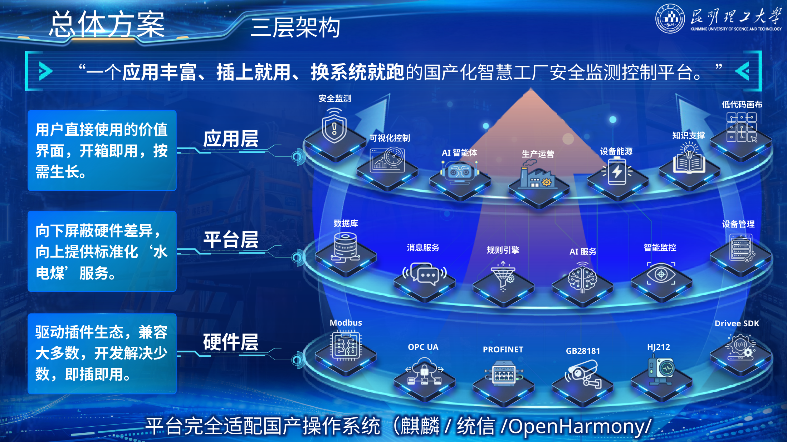
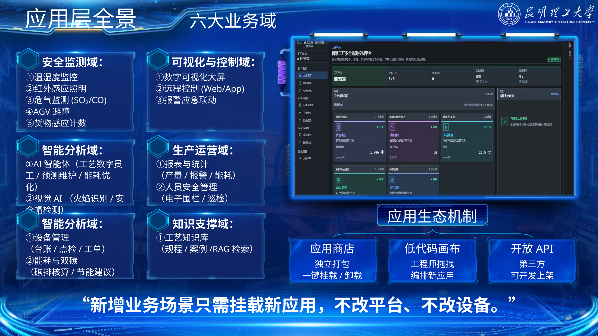
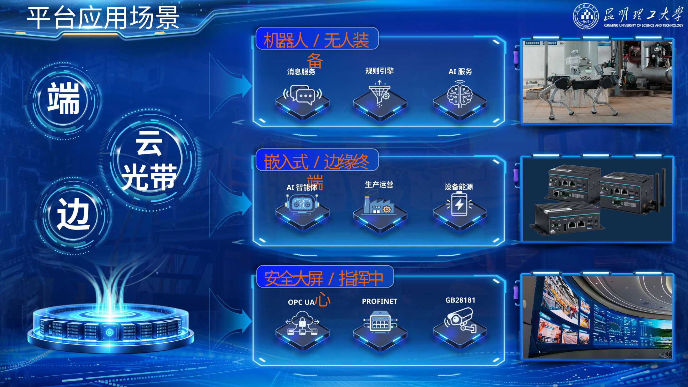
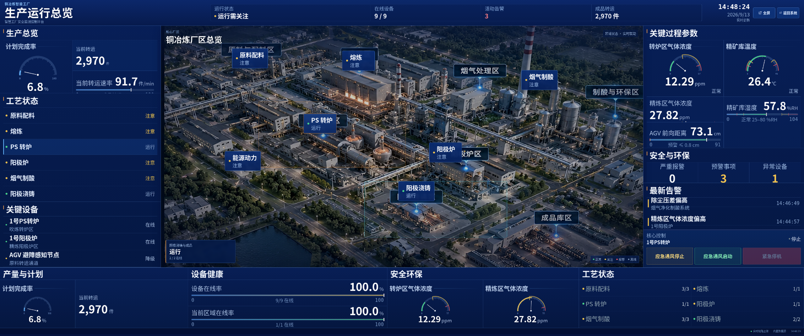

{width="8.3in" height="11.7in"}

# 一、项目整体介绍

龙台智控面向铜冶炼等流程工业，在国产操作系统上连接PLC、DCS、传感器、气体分析仪、工业相机和边缘终端，并提供安全监测、设备管理、生产运营、知识服务和AI辅助分析。平台通过设备、协议和操作系统适配层兼容存量工业系统，使新增业务能够在不重构原有控制体系的情况下逐步部署。

项目首先解决三类问题：不同品牌设备和协议难以统一接入，现有系统以数据展示和阈值报警为主，定制项目难以跨工厂复制。围绕这三类问题，平台采用“硬件层—平台层—应用层”三层架构：硬件层负责连接现场设备，平台层统一提供设备、数据、消息、规则、权限、审计和AI服务，应用层直接承载现场业务。

> **一个应用丰富、插上就用、换系统就跑的国产化分布式工业智能平台。**

“插上就用”对应设备和协议的插件化接入，“换系统就跑”对应不同国产操作系统之间的快速迁移与适配。平台不替代DCS、PLC或SIS的核心控制职责，而是在既有自动化体系之上增加统一接入、业务协同和智能分析能力。

平台核心软件采用原生C++后端与Vue 3 / TypeScript工业HMI，通过REST与WebSocket实现前后端通信，覆盖设备状态、历史数据、报警管理、事件处置、报表、RBAC权限、操作审计、命令记录和SQLite数据持久化。DeviceAdapter、ProtocolAdapter、OsAdapter分别承担设备、协议和操作系统适配，并支持OpenHarmony/HongZOS应用壳，以及银河麒麟、统信UOS、通用POSIX和远程SSH目标机部署。六大业务域建立在这一统一底座之上：

| 业务域 | 重点场景 |
|---|---|
| 安全监测 | 温湿度、红外照明、SO₂/CO危气、AGV避障、货物计数 |
| 可视化与控制 | 工业大屏、Web/App远程控制、报警应急联动 |
| 智能分析 | 异常分析、智能问答、视觉AI、预测维护、能耗优化 |
| 生产运营 | 报表统计、人员安全、巡检与运营分析 |
| 设备能源 | 设备台账、点检、工单、能耗与双碳 |
| 知识支撑 | 工艺知识库、规程案例、RAG检索 |

人工智能承担数据分析、知识检索、异常研判和处置建议，关键生产控制、安全联锁和高风险设备动作仍由确定性规则、安全保护逻辑和授权人员共同约束。项目坚持**人工最终决策**。

商业化采用“平台授权 + 驱动/协议接入 + 场景插件 + 现场实施 + 维保续费”的收入结构，从单场景验证进入标准车间，再扩展到全厂平台和集团多基地。

# 二、项目背景

## 2.1 行业现状与需求

制造业数字化、智能化和国产化同步推进，工业软件正在从单点工具转向自主可控、互联协同和智能化平台。对工业企业而言，国产化并不是简单更换操作系统，真正影响系统落地的是设备驱动、工业协议、运行环境、实时性、安全性和应用生态。

铜冶炼等流程工业已经形成大量长期运行的DCS、PLC和专用设备。设备年代、厂商和通信接口差异明显，同时具有连续生产、高安全约束和存量系统不可轻易替换等特点。新增数字化系统必须能够兼容现有设备和控制体系，避免大规模停产改造。

工业数字化的需求也从“看见数据”进一步转向“识别异常、辅助判断、联动处置和全过程留痕”。趋势曲线、报表和阈值报警仍是基础能力，但安全管理、设备运维和生产协同需要更完整的数据链路和业务闭环。

## 2.2 痛点分析

### 2.2.1 生态适配鸿沟

工业现场同时存在串口、以太网、CAN、现场总线、工业以太网、视频和环保数据等多类接口与协议。不同国产操作系统对驱动、SDK、协议栈和硬件BSP的支持程度不同，设备接入和系统迁移容易演变为重复开发。

龙台智控把设备连接、协议解析和操作系统差异限制在适配边界内，上层业务通过统一接口访问现场设备，降低应用对具体厂商和系统环境的依赖。

### 2.2.2 智能能力鸿沟

传统工业系统大量功能停留在采集、展示、报表和阈值报警。复杂工况诊断、异常原因分析和跨系统协同仍依赖人员经验。

平台把现场数据、知识库和AI辅助分析接入同一业务流程，使智能能力能够参与真实工业工作流，同时通过权限、规则和审计限制执行边界。

### 2.2.3 交付复制鸿沟

传统项目常把设备适配、协议配置和业务逻辑固化在单个项目代码中，进入下一工厂后仍需重新开发。龙台智控把共性部分沉淀为平台服务，把差异部分收敛到驱动、协议、应用和配置层，减少跨项目重复建设。

# 三、技术核心

## 3.1 产品概述：一个应用驱动的国产化平台

龙台智控采用“应用驱动、平台支撑、插件连接、国产运行”的技术体系。

| 层级 | 主要内容 | 作用 |
|---|---|---|
| 应用层 | 安全监测、可视化控制、设备管理、报表分析、AI辅助等 | 直接面向现场人员和管理人员 |
| 平台层 | 设备、数据、消息、规则、权限、审计、AI、运行服务 | 为应用提供公共能力 |
| 硬件/协议层 | PLC、DCS、传感器、气体分析仪、工业相机、AGV及各类工业协议 | 连接现场设备并统一接口 |

平台的产品关系可以概括为：**大屏是入口，插件是能力，平台是底座。**

## 3.2 应用层：平台价值的直接呈现

应用层以设备状态、历史数据、报警、事件、报表、权限审计和命令记录等基础能力为支撑，组织安全监测、可视化与控制、生产运营、设备能源、知识支撑和智能分析等业务。

扩展应用采用独立打包、插件挂载、开放API和低代码编排思路。其目标是让新增业务尽量复用既有设备接入、数据、权限、消息和规则服务，而不是重新建设一套系统。

## 3.3 平台层：标准化服务支撑

平台层围绕设备、数据、消息、规则、权限、审计和运行管理组织公共服务。原生C++应用服务通过REST和WebSocket与Vue 3 / TypeScript HMI通信；SQLite承担配置与业务数据持久化；RBAC、操作审计和命令记录贯穿用户操作和控制链路。

设备注册表、指令运行时以及设备、协议、操作系统三类适配边界把业务界面与现场环境隔离。普通、实时和紧急三类指令执行域用于区分不同执行要求，并保留完整命令记录。

AI能力作为可选服务接入平台。知识库、工具调用和多智能体协作沿统一权限和审计框架扩展，不改变关键工业控制由确定性系统承担的基本边界。

## 3.4 硬件感知与协议对接层：设备接入基础

平台通过DeviceAdapter、ProtocolAdapter等适配边界承载现场设备与协议接入，面向Modbus、OPC UA、PROFINET、GB28181、HJ212等常见工业通信需求，并可扩展至CAN、工业以太网和厂商协议。

协议兼容性采用“成熟生态—工程适配—专项开发”三级评价。该分级描述不同操作系统和硬件条件下的适配路径，不等同于操作系统原生预装，也不等同于全部协议与硬件组合均已完成项目实测。

| 工业接口/协议 | 麒麟/UOS | OpenHarmony/行业版 | 主要工程条件 |
|---|---|---|---|
| RS-232 / RS-485 / UART | 成熟生态 | 工程适配 | 串口驱动、HDF/BSP |
| Modbus RTU / TCP | 成熟生态 | 行业版可适配 | 协议栈、点表、字节序、超时 |
| OPC UA | 成熟生态 | 工程适配 | SDK、节点、订阅、证书 |
| MQTT / HTTP / WebSocket | 成熟生态 | 成熟生态 | TCP/TLS、会话与重连 |
| CAN / CAN FD | 成熟生态 | 工程适配 | 控制器驱动、SocketCAN或对应驱动 |
| PROFINET / EtherNet/IP / EtherCAT | 工程适配 | 专项开发 | 协议栈、通信卡、实时性验证 |
| IEC 60870 / IEC 61850 / HJ212 | 工程适配 | 工程适配或专项开发 | 报文、链路、SCL、时延与安全要求 |
| PLC厂商协议 | 工程适配 | 专项开发 | 按品牌、型号和协议栈验证 |

## 3.5 技术路线

### 3.5.1 端—边—云协同

终端和边缘侧承担设备接入、协议适配、实时数据、规则和低时延处理，中心平台承担跨设备数据汇聚、生产运营、设备能源、知识服务和AI分析。低时延与强现场依赖任务尽量靠近设备执行，跨域管理和知识类任务由中心平台承担。

### 3.5.2 国产操作系统适配

银河麒麟、统信UOS等Linux类国产操作系统重点复用成熟用户态协议栈和Linux设备生态；OpenHarmony及行业版重点结合HDF、BSP、设备服务和行业扩展能力完成终端与边缘侧适配。上层应用通过OsAdapter等适配边界减少对具体系统API的直接依赖。

### 3.5.3 AI扩展路线

AI能力按照“数据访问—知识检索—工具调用—受控执行”逐步接入平台。ReAct机制用于组织感知、分析、工具选择和结果反馈；MCP工具和知识库负责连接真实数据与业务资源；关键动作进入权限校验、规则约束和人工确认。

## 3.6 核心技术壁垒

龙台智控的技术壁垒集中在四个方面：第一，跨国产操作系统、国产CPU和工业现场设备的组合适配；第二，设备、协议和操作系统三类适配边界带来的可迁移性；第三，安全监测、设备管理、事件处置和控制审计共享同一平台底座；第四，AI能力能够在权限、规则和审计约束下进入真实工业工作流。

这些能力共同决定平台能否从一次项目交付转向跨场景、跨工厂复用。

## 3.7 核心应用场景

五类安全场景采用统一的验收指标口径：

| 场景 | 验收指标 |
|---|---|
| 危气监测 | 采集链路≤500 ms，报警/联动响应≤1 s |
| 温湿度监控 | 采集≤1 s，温度±0.5°C，湿度±3%RH |
| 红外感应照明 | 响应≤500 ms，感应距离3—7 m |
| AGV避障 | 响应≤100 ms |
| 货物计数 | 准确率≥99.5% |
| 视觉AI | 推理帧率≥15 fps |

# 四、项目应用

## 4.1 项目实践（时间线）

| 时间 | 项目进展 |
|---|---|
| 2026年5月 | 完成参赛方案v2.0和国产操作系统平台调研，明确铜冶炼场景、五类安全监测功能、国产OS适配方向和总体技术路线 |
| 2026年9月 | 完成1.8.0核心版本，形成Vue 3 / TypeScript工业HMI、原生C++后端、设备/协议/OS三类适配边界及目标系统部署框架 |
| 2026年9月13日 | C++核心软件完成构建，CTest自动化测试10项通过、0项失败 |

项目已从参赛方案阶段进入平台源码、部署框架和产品方案同步完善阶段。

## 4.2 项目落地（验证与演示）

龙台智控以铜冶炼为首个综合应用场景，形成“6大业务域、5类安全场景、国产化平台支撑”的应用结构。现场设备通过边缘侧接入，平台统一处理设备状态、历史数据、报警、事件、报表、权限、审计和控制记录，上层业务再按场景组合。

C++核心软件完成构建验证，CTest自动化测试结果为**10项通过、0项失败**。平台配套Vue前端、OpenHarmony/HongZOS应用壳，以及银河麒麟、统信UOS、POSIX和远程SSH部署框架。

危气监测业务链路为：

**多源采集 → 数据校验 → 实时呈现 → 阈值判定 → 分级告警 → 岗位推送 → 人工确认 → 处置反馈 → 留痕归档**

> 行业厂区和国产硬件示意图片用于说明典型场景与设备形态，不作为项目实际部署现场或采购证明。

## 4.3 实测数据与演示脚本

项目演示围绕“功能完整、国产化运行、跨场景复用”三项能力展开，3.7所列指标作为场景验收口径。

演示顺序为：平台总览 → 危气监测 → 分级报警 → 人工确认 → 受控联动 → AI辅助分析 → 其他安全场景 → 国产化运行环境 → 应用扩展。

# 五、市场分析

## 5.1 行业背景与痛点

龙台智控位于国产化工业软件、工业互联网、智能制造和工业安全数字化的交叉市场。客户采购需求主要来自四个方向：国产运行环境替换或新增、存量设备持续接入、安全与生产数据统一管理，以及AI进入真实工业工作流。

平台的购买价值集中在三点：**不推倒重建现有自动化系统、减少多品牌设备和协议的重复集成、把新增安全和智能应用建立在同一平台上。** 对连续生产企业而言，这种增量式建设方式比重新建设独立系统更容易控制改造范围和后续维护成本。

## 5.2 目标市场细分

第一层市场是**铜冶炼及有色冶金**。该类企业具有高温、危气、连续生产和设备异构等典型特征，与项目首发场景匹配度最高。

第二层市场是**钢铁、化工等流程工业**。其共同特征是自动化基础较强、现场协议复杂、安全约束高，对设备接入、报警联动、运维和知识服务存在相似需求。

第三层市场是**能源、工业园区及其他高风险工业场景**。该类客户更关注跨区域设备接入、集中监控、国产化部署和平台化运维。

项目采用“先在铜冶炼形成样板，再向相邻流程工业复制”的行业进入路径，避免早期产品线过度分散。

## 5.3 目标客户画像

| 决策角色 | 主要问题 | 龙台智控对应价值 | 典型切入点 |
|---|---|---|---|
| 安全/环保负责人 | 报警分散、事件处置难追溯 | 统一监测、分级报警、处置留痕 | 危气、环境与人员安全 |
| 自动化/信息化负责人 | 多协议、多品牌、国产化迁移复杂 | 适配层、统一接口、国产OS部署 | 设备接入与平台底座 |
| 生产/设备负责人 | 状态、报警、工单和报表分散 | 统一设备状态和业务数据 | 设备管理、巡检、报表 |
| 企业管理层 | 单点系统重复建设、难复制 | 平台复用、场景扩展、集团复制 | 标准车间或全厂平台 |

客户为什么会买，不取决于单个算法指标，而取决于平台能否兼容存量系统、降低重复集成、形成清晰的安全与运营闭环，并在后续新增场景时继续复用。

## 5.4 市场规模测算

项目采用“目标客户数量 × 产品档位”的项目单元法测算市场容量。按照标准车间**180—300万元/项目**的价格区间：

| 标准车间数量 | 对应市场容量 |
|---:|---:|
| 10个 | 1800—3000万元 |
| 50个 | 0.9—1.5亿元 |
| 100个 | 1.8—3.0亿元 |

按照全厂平台**400—800万元/项目**的价格区间：

| 全厂客户数量 | 对应市场容量 |
|---:|---:|
| 10家 | 0.4—0.8亿元 |
| 50家 | 2—4亿元 |
| 100家 | 4—8亿元 |

上述换算用于展示单位客户池对应的商业规模，不等同于全国目标客户数量。项目的可获取市场取决于实际可触达企业数量、试点转化率、交付能力和行业复制速度。

公开交易案例中，**铜陵郊区经开区智慧园区（二期）工业互联网平台及行业大脑建设项目**（项目编号TLCG2026F004）预算及最高限价为**249.60516万元**，最终合同金额为**224万元**；合同约定平台建设期为120个日历天，运营维护期为3年。该项目采购范围与龙台智控不同，仅用于参照工业互联网平台项目的交易量级与服务周期。

## 5.5 竞品分析

市场上的相关解决方案可归纳为现场监控与可视化、生产管理与业务协同、流程工业智能优化、工业互联与场景应用四类。龙台智控的差异集中在国产化运行环境、统一设备接入、五类安全场景、控制审计和AI工作流的组合。

| 对比维度 | 龙台智控 | 现场监控类 | 生产管理类 | 流程工业智能优化类 | 工业互联类 |
|---|---|---|---|---|---|
| 国产化 | 多国产OS适配路线 | 以PC/Windows方案较多 | 可提供信创适配 | 通常围绕特定运行环境 | 可结合国产网关或自研OS |
| 现场接入 | 设备/协议适配边界 | 多品牌PLC、多协议 | 以业务系统数据为主 | OPC/实时数据库接入较多 | 多协议边缘网关 |
| AI | 异常分析、知识问答、受控工具调用 | AI助手为主 | 排程、配料等业务AI | 趋势预测、异常诊断 | 视觉质检、故障诊断 |
| 安全闭环 | 监测、报警、确认、联动、审计 | 报警为主 | 需与现场系统集成 | 以预警和指导为主 | 以场景联动为主 |
| 扩展方式 | 平台 + 适配 + 场景插件 | 工程配置 | 模块扩展 | 模型/业务模块扩展 | 网关和应用扩展 |

龙台智控不替代成熟DCS、MES或EAM，而是连接这些存量系统，在国产化底座上增加统一接入、安全监测、业务协同和智能分析。

# 六、商业模式

## 6.1 产品与服务模式

收入由五部分组成：

1. **平台授权**：基础平台、核心服务和管理能力；
2. **驱动/协议接入**：按现场设备和协议范围完成接入与适配；
3. **场景插件**：提供安全、视觉、设备、能源、生产等业务应用；
4. **现场实施**：完成部署、配置、数据治理、联调、测试和培训；
5. **维保续费**：提供版本升级、巡检、技术支持和持续运维。

这种结构使首次合同解决“能不能用”，后续扩展合同解决“还能增加什么”，维保合同解决“长期怎么运行”。

## 6.2 定价与盈利模式

| 产品档位 | 预测价格 | 典型范围 |
|---|---:|---|
| 场景验证 | 60—100万元/项目 | 单场景、1—2种协议 |
| 标准车间 | 180—300万元/项目 | 3—5种协议、2—4个插件 |
| 全厂平台 | 400—800万元/项目 | 多节点、系统接口 |
| 集团多基地 | 800—1500万元以上/项目 | 多工厂、集中运维 |

以**240万元**标准车间为例：

| 项目 | 金额（万元） |
|---|---:|
| 平台授权 | 60 |
| 协议接入 | 40 |
| 场景插件 | 80 |
| 数据治理与系统联调 | 45 |
| 测试培训 | 15 |
| 合计 | 240 |

免费维保期结束后，年维保续费按合同额的**12%—18%**测算。240万元项目对应年维保收入约**28.8—43.2万元**。

标准报价不包含传感器、工业网络及PLC/DCS/SIS等核心控制系统的大规模改造，新增硬件、网络施工和自动化改造独立核算。

## 6.3 推广路径

商业化采用“**样板场景—标准车间—全厂平台—集团多基地**”四级路径。

第一阶段以危气监测、视觉安全或设备接入等明确问题形成样板项目，用较小范围证明兼容性、响应速度和现场价值。第二阶段在同一车间复用已经完成的设备接入和平台服务，增加更多场景插件。第三阶段向多车间扩展，统一权限、数据、报警、规则和运维。第四阶段在集团内部复用已有适配和应用资产，形成跨基地部署。

销售重点首先面向安全、自动化、信息化和设备部门建立技术入口，再通过已验证场景向生产运营和集团级平台扩展。行业合作伙伴和系统集成商可承担部分本地实施与设备接入工作，平台方集中维护核心软件、适配资产和版本体系。

## 6.4 财务预测及分析

三年收入采用基准情景测算。项目数量属于商业模型假设，不代表已签订单；场景验证、标准车间和全厂平台分别采用80万元、240万元和500—600万元的典型客单价。维保模型假设项目交付首年处于免费维保期，自次年起按原合同额的12%进入付费维保，并在测算期内持续续费。

| 年度 | 新增项目收入 | 付费维保收入 | 预计收入 |
|---|---:|---:|---:|
| 第1年 | 2项场景验证×80万 + 1项标准车间×240万 = 400万 | — | **400万元** |
| 第2年 | 2项场景验证×80万 + 2项标准车间×240万 + 1项全厂平台×500万 = 1140万 | 第1年合同400万×12% = 48万 | **1188万元** |
| 第3年 | 3项场景验证×80万 + 3项标准车间×240万 + 1项全厂平台×600万 = 1560万 | 前两年累计新增合同1540万×12% = 184.8万 | **1744.8万元** |

三年累计收入约**3332.8万元**，其中新增项目收入3100万元、付费维保收入232.8万元。该情景未计入集团多基地项目，也未计入硬件销售和大型自动化改造收入。

成本主要由研发适配、现场实施、差旅、测试培训、第三方软硬件和维保工时构成。项目盈利能力取决于驱动、协议和场景插件的复用程度：复用率提高后，新项目中的重复研发和现场实施投入下降，平台授权和标准化软件收入占比相应提高。

三年商业化重点跟踪合同额、标准化产品收入占比、插件复用率、实施人天、续费率和客户扩展收入。

# 七、项目团队

## 7.1 团队概况

团队覆盖技术研发、生产场景、财务、风险、战略和市场等职能，并由冶金过程、数字化等专业教师提供指导。团队具有软件平台、算法建模、全栈系统、边缘AI、冶炼智能化项目和市场分析等经验。

团队及项目相关成果包括1部2025年度有色金属工业科技进步奖推荐书、2件实用新型专利、6项计算机软件著作权、9篇论文和23件发明专利，其中包括团队成员既有成果、项目相关成果和项目直接成果。

## 7.2 团队成员

### 王一然｜团队负责人兼技术主管

发表SCI论文2篇，拥有发明专利2件、软件著作权2项；以第一负责人获得国家级高水平竞赛奖项6项；具备智慧养老、居家监管等全栈项目经验，并参与山东电网财务平台、Scratch编程教育平台等系统建设。

### 田杰文｜生产主管

参与多个冶炼智能化相关横向项目，已申请专利1件，曾获节能减排竞赛国家二等奖，负责生产场景与工业需求衔接。

### 张雯｜财务主管

曾获“互联网+”校赛奖项，依托财务专业承担量化模型和商业测算工作。

### 赵荣怡｜风控主管

曾获全国高校BIM设计毕业设计创新大赛三等奖、云南省市场调查与分析大赛三等奖，承担风险识别、项目合规和市场调研工作。

### 杨森远｜战略规划主管

曾任国家级创新创业立项项目负责人，获市场调查大赛省级一等奖，拥有软件著作权2项，承担项目战略规划工作。

### 胡峰｜项目研发

参与开发氧化还原终点判断系统5套，获研究生数学建模“华为杯”国赛三等奖，承担复杂系统建模、算法和研发工作。

### 何芸芸｜市场主管

在市场分析领域发表学术论文1篇，具有四年学生干部经历，承担市场研究、外部协作和推广工作。

## 7.3 指导教师团队

顾问与指导教师团队包括王华、徐建新、陈志芳等。

王华长期从事冶金过程强化与节能减碳研究，获国家科技进步一等奖1项、二等奖1项，以及云南省杰出贡献奖和多项省部级科技奖励，研究方向包括低温余热高效利用、多相流强化传热、冶金过程数字化与智能化。
